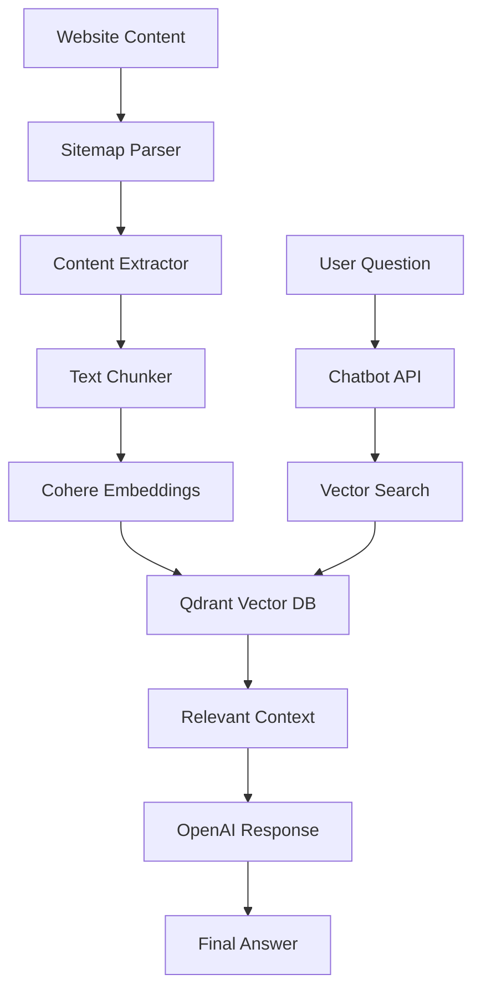

# RAG Website Ingestion Pipeline & Chatbot API

This repository contains a complete RAG (Retrieval Augmented Generation) system for the Physical AI & Humanoid Robotics course website, including:

1. **Content Ingestion Pipeline**: Extracts and vectorizes website content
2. **Chatbot API**: FastAPI server for answering questions about the course
3. **React Chatbot Component**: Embedded chat interface for the Docusaurus site

## Overview

### Ingestion Pipeline
The pipeline performs the following steps:
1. **Sitemap Parsing**: Discovers all content URLs from the sitemap.xml
2. **Content Extraction**: Extracts clean educational text from each Docusaurus page
3. **Text Chunking**: Splits content into semantically meaningful chunks
4. **Embedding Generation**: Creates vector embeddings using Cohere's embed-english-v3.0 model
5. **Vector Storage**: Stores embeddings in Qdrant Cloud with rich metadata

### Chatbot API
The FastAPI server provides:
- Question answering about course content
- Context-aware responses using selected text
- Conversation history management
- Source citation from textbook sections

## Prerequisites

- Python 3.11+
- Node.js 20+ (for Docusaurus)
- UV package manager (optional but recommended)
- Cohere API key
- Qdrant Cloud account and API credentials
- OpenAI API key (for chatbot responses)

## Setup

### 1. Install Dependencies

Using pip:
```bash
pip install -r requirements.txt
```

Or using UV (recommended for faster installs):
```bash
uv pip install -r requirements.txt
```

### 2. Configure Environment Variables

Copy the example environment file and fill in your credentials:

```bash
cp .env.example .env
```

Then edit `.env` and add your API keys:
- `COHERE_API_KEY`: Your Cohere API key from [Cohere Dashboard](https://dashboard.cohere.ai/api-keys)
- `QDRANT_URL`: Your Qdrant Cloud cluster URL
- `QDRANT_API_KEY`: Your Qdrant Cloud API key
- `OPENAI_API_KEY`: Your OpenAI API key from [OpenAI Platform](https://platform.openai.com/api-keys)

## Usage

### Running Content Ingestion

```bash
python main.py
```

This will:
- Parse the sitemap from `https://hackathon-physical-ai-humanoid-text-sigma.vercel.app/sitemap.xml`
- Extract content from all discovered pages
- Create vector embeddings for each text chunk
- Store everything in a Qdrant collection named "physical_ai_humanoid_textbook"

### Running the Chatbot API

```bash
python chatbot_api.py
```

The API will start on `http://localhost:8000` and provide the following endpoints:

- `GET /`: API information and available endpoints
- `GET /health`: Health check with service status
- `POST /chat`: Send messages to the chatbot
- `GET /conversations/{id}`: Get conversation history
- `DELETE /conversations/{id}`: Delete conversation

### Using the Unified Runner

```bash
# Check environment configuration
python run.py check

# Run content ingestion only
python run.py ingest

# Start chatbot API only
python run.py api

# Run both ingestion and API
python run.py all
```

## API Usage

### Chat API

Send a POST request to `/chat` with this JSON payload:

```json
{
  "message": "What is sensorimotor intelligence?",
  "selected_text": "optional selected text from the page",
  "conversation_id": "optional existing conversation ID",
  "module_filter": "optional module name to filter results",
  "max_results": 5
}
```

Response format:
```json
{
  "response": "AI-generated answer...",
  "conversation_id": "conv_123456",
  "sources": [
    {
      "text": "Source text preview...",
      "url": "https://...",
      "title": "Page Title",
      "module": "Module Name",
      "section": "Section Name",
      "score": 0.85
    }
  ],
  "confidence_score": 0.92
}
```

## Configuration

The pipeline has several configurable parameters in `main.py`:

- `chunk_size`: Size of text chunks (default: 1000 characters)
- `chunk_overlap`: Overlap between chunks (default: 100 characters)
- `delay_range`: Delay range between requests (default: 1-2 seconds)
- `vector_size`: Embedding dimension (default: 1024 for Cohere model)

## Architecture



## Testing

After running the ingestion pipeline, you can test the system:

```bash
python main.py  # This includes a test search at the end
```

Or test the API directly:

```bash
curl -X POST "http://localhost:8000/chat" \
     -H "Content-Type: application/json" \
     -d '{"message": "What is humanoid robotics?"}'
```

## Troubleshooting

### Common Issues

1. **API Key Errors**: Ensure all required environment variables are set
2. **Connection Issues**: Check your internet connection and API endpoints
3. **Memory Issues**: Reduce `chunk_size` or `max_results` if experiencing memory problems
4. **Rate Limits**: Increase `delay_range` if hitting API rate limits

### Logs

Check the following log files:
- `ingestion.log`: Content ingestion pipeline logs
- `chatbot.log`: Chatbot API logs

## Development

### Adding New Features

1. **Content Sources**: Modify `get_sitemap_urls()` to support additional websites
2. **Embedding Models**: Update the Cohere model version in `embed_chunks()`
3. **Response Quality**: Adjust the OpenAI system prompt in `generate_response()`
4. **UI Customization**: Modify the React component styles and behavior

### Code Structure

```
backend/
├── main.py              # Content ingestion pipeline
├── chatbot_api.py       # FastAPI chatbot server
├── run.py              # Unified runner script
├── requirements.txt    # Python dependencies
├── .env.example       # Environment template
└── README.md          # This file
```

## License

This project is part of the Physical AI & Humanoid Robotics Course Book.