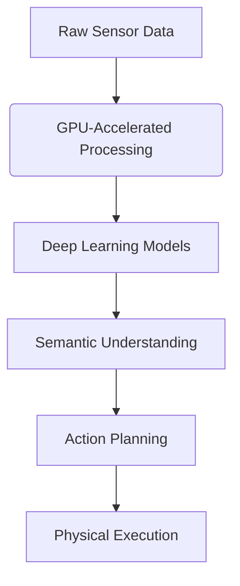

# Chapter 4: The Mind of the Machine - NVIDIA Isaac and AI-Powered Robotics

## Opening Narrative: The Dawn of Cognitive Robotics

In a laboratory at the intersection of artificial intelligence and robotics, something unprecedented is happening. A robotic arm, guided by NVIDIA's Isaac platform, reaches for a coffee cup with a dexterity that rivals human capability. But this is not a pre-programmed sequence—it's an intelligent system that has learned to grasp thousands of different objects, each with its own shape, weight, and surface properties. The robot sees the cup, understands its affordances, plans a trajectory that accounts for the physics of the situation, and executes the grasp with just the right amount of force.

This moment represents the dawn of cognitive robotics—the fusion of artificial intelligence and physical embodiment that transforms mechanical devices into intelligent agents capable of perception, reasoning, and adaptive behavior. The NVIDIA Isaac platform stands at the forefront of this revolution, providing the computational foundation that enables robots to think as well as act.

## The Evolution of Robotic Intelligence: From Reactive to Cognitive

### The Reactive Era: Programming Every Contingency

The first generation of robots was fundamentally reactive. They responded to sensor inputs with pre-programmed behaviors, like elaborate wind-up toys that followed predetermined patterns. A robot might be programmed: "If sensor detects obstacle, turn left; if sensor detects cliff, turn right." This approach worked for simple, predictable environments but failed miserably in the complex, dynamic world where Physical AI must operate.

The limitations were profound: every possible situation had to be anticipated and programmed, every edge case considered, every contingency planned for. The result was brittle systems that worked well in controlled environments but collapsed when faced with the slightest variation from their programming.

### The Learning Revolution: Intelligence Through Experience

The breakthrough came with the realization that robots could learn from experience, just as biological systems do. Instead of programming explicit responses to every situation, we could program systems that learn to respond appropriately through interaction with their environment. This shift from programmed behavior to learned behavior represents the fundamental transformation that AI brings to robotics.

The NVIDIA Isaac platform embodies this philosophy, providing the tools and computational power necessary for robots to develop cognitive capabilities. It's not just about faster processing—it's about enabling fundamentally different approaches to robotic intelligence.

### The Isaac Architecture: Where AI Meets Embodiment

NVIDIA Isaac represents more than a collection of tools—it's a philosophy of how artificial intelligence and physical embodiment should interact. The platform recognizes that intelligence emerges from the continuous interaction between perception, action, and learning, and it's designed to support this interaction at every level.

## The Cognitive Architecture: Perception, Reasoning, and Action

### Isaac ROS: The Neural Pathways of AI Perception

Isaac ROS extends the traditional ROS 2 framework with AI-specific capabilities, creating the neural pathways through which intelligent robots perceive and understand their environment. Unlike traditional ROS nodes that process sensor data through fixed algorithms, Isaac ROS nodes incorporate learned models that can adapt and improve over time.

#### GPU-Accelerated Perception

The cornerstone of Isaac ROS is its ability to accelerate perception using GPU computing. This is not merely a performance optimization—it enables entirely new approaches to robotic perception:



Traditional CPU-based processing might analyze a scene at 10-30 frames per second, sufficient for basic navigation but inadequate for complex manipulation. GPU acceleration enables real-time processing of high-resolution imagery with sophisticated deep learning models, allowing robots to understand not just what they see, but what it means.

#### Multi-Modal Perception Integration

Isaac ROS excels at integrating information from multiple sensors using AI techniques. Rather than treating camera, LIDAR, and tactile sensors as separate data streams, Isaac learns to combine them in ways that reveal information that no single sensor could provide. A robot might visually identify an object as "soft" but only confirm this through tactile feedback, or use visual and inertial information together to estimate the mass of an object before lifting it.

### Isaac Sim: The Cognitive Laboratory

Isaac Sim provides more than just physics simulation—it creates cognitive laboratories where robots can develop and refine their understanding of the physical world. Unlike traditional simulators that simply test pre-programmed behaviors, Isaac Sim enables learning and adaptation within the simulation environment.

#### Photorealistic Training Environments

The visual fidelity of Isaac Sim is not just aesthetic—it's essential for training computer vision systems that will operate in the real world. By training AI models on photorealistic imagery, robots develop visual understanding that transfers effectively to real environments. The same neural network that learns to recognize objects in simulated lighting conditions can recognize them in real-world variations.

#### Physics-Based Learning

Isaac Sim's accurate physics modeling enables robots to learn the fundamental principles of physical interaction. A robot can learn that heavy objects require more force to move, that smooth surfaces are slippery, that fragile objects break under excessive pressure. This physics-based learning provides the foundation for safe, effective physical interaction.

### Isaac Lab: The Framework for Cognitive Development

Isaac Lab provides the framework for developing cognitive capabilities through machine learning. It's designed around the principle that intelligence emerges through interaction with the environment, providing tools for:

#### Reinforcement Learning Environments

Isaac Lab creates reinforcement learning environments where robots learn through trial and error. Rather than programming explicit behaviors, we define objectives and let the robot learn optimal strategies through interaction. A robot might learn to walk by receiving positive rewards for forward motion and negative rewards for falling, gradually developing stable locomotion patterns.

#### Imitation Learning

Sometimes the most efficient way to teach a robot is to show it how. Isaac Lab supports imitation learning, where robots observe human demonstrations and learn to replicate complex behaviors. This approach is particularly valuable for manipulation tasks that would be difficult to program explicitly.

## The Deep Learning Pipeline: From Training to Deployment

### Model Training: The Cognitive Development Phase

The process of creating AI-powered robotic systems begins with training neural networks to understand the relationship between perception and action. This training phase involves several key components:

#### Data Collection and Annotation

Effective AI requires high-quality training data. For robotics, this means collecting sensor data paired with appropriate actions or outcomes. Isaac Sim can generate vast quantities of training data with perfect annotations—every pixel is labeled, every physics parameter is known, every outcome is recorded.

#### Network Architecture Selection

Different robotic tasks require different neural network architectures. For perception tasks, convolutional networks excel at processing visual information. For sequential decision-making, recurrent networks can maintain internal states. For real-time control, specialized architectures balance accuracy with speed.

#### Training Optimization

Training neural networks for robotics involves unique challenges. The networks must be robust to sensor noise, lighting variations, and environmental changes. Techniques like domain randomization ensure that networks trained in simulation can operate effectively in the real world.

### TensorRT: The Deployment Engine

Once trained, neural networks must be deployed to robotic systems where they operate in real-time with limited computational resources. TensorRT provides the optimization that makes this deployment possible.

#### Model Optimization Techniques

TensorRT employs several optimization techniques to maximize inference speed while maintaining accuracy:

- **Quantization**: Reducing precision from 32-bit floating point to 8-bit integers
- **Pruning**: Removing unnecessary network connections
- **Layer fusion**: Combining multiple operations into single kernels
- **Memory optimization**: Efficiently managing GPU memory usage

#### Real-Time Performance Guarantees

Robotic systems require predictable performance. TensorRT provides tools for analyzing and guaranteeing inference times, ensuring that AI perception doesn't become a bottleneck in real-time control systems.

### Practical Implementation: Building Cognitive Robotic Systems

Let's examine how these concepts come together in a practical implementation:

```python
#!/usr/bin/env python3
"""
Cognitive Robotic Perception System
This node implements a complete AI-powered perception pipeline
using NVIDIA Isaac's cognitive computing capabilities.
"""

import rclpy
from rclpy.node import Node
from sensor_msgs.msg import Image, PointCloud2, LaserScan, Imu
from geometry_msgs.msg import Twist, PoseStamped
from std_msgs.msg import String
from cv_bridge import CvBridge
import numpy as np
import torch
import torch.nn as nn
import tensorrt as trt
import pycuda.driver as cuda
import pycuda.autoinit
from typing import Dict, List, Tuple, Optional
import time
from dataclasses import dataclass

@dataclass
class CognitiveState:
    """The internal cognitive state of the robot"""
    objects_detected: List[Dict]  # List of detected objects with properties
    affordances_identified: List[Dict]  # Action possibilities in the environment
    environmental_model: Dict  # Internal model of the environment
    task_context: str  # Current high-level task
    confidence_scores: Dict  # Confidence in various perceptions
    last_update: float

class CognitivePerceptionNode(Node):
    """
    A cognitive perception system that goes beyond simple sensor processing
    to create meaningful understanding of the environment.

    This system embodies the principles of Physical AI by:
    1. Integrating multiple sensor modalities through AI
    2. Creating semantic understanding from raw sensor data
    3. Maintaining internal cognitive states for decision making
    4. Learning and adapting through experience
    """

    def __init__(self):
        super().__init__('cognitive_perception_node')

        # Initialize core components
        self.bridge = CvBridge()
        self.cognitive_state = CognitiveState(
            objects_detected=[],
            affordances_identified=[],
            environmental_model={},
            task_context="exploring",
            confidence_scores={},
            last_update=time.time()
        )

        # Initialize AI models (using TensorRT for deployment)
        self.perception_model = self.initialize_perception_model()
        self.affordance_model = self.initialize_affordance_model()
        self.action_model = self.initialize_action_model()

        # Sensor subscribers with appropriate QoS
        self.image_subscription = self.create_subscription(
            Image, '/camera/image_raw', self.image_callback, 10
        )
        self.laser_subscription = self.create_subscription(
            LaserScan, '/scan', self.laser_callback, 10
        )
        self.imu_subscription = self.create_subscription(
            Imu, '/imu/data', self.imu_callback, 10
        )

        # Publishers for cognitive outputs
        self.object_publisher = self.create_publisher(
            String, '/cognitive/objects', 10
        )
        self.action_publisher = self.create_publisher(
            String, '/cognitive/actions', 10
        )
        self.environment_publisher = self.create_publisher(
            String, '/cognitive/environment', 10
        )

        # Timer for cognitive processing loop
        self.cognitive_timer = self.create_timer(0.033, self.cognitive_processing_loop)  # ~30 Hz

        self.get_logger().info('Cognitive Perception System initialized')

    def initialize_perception_model(self):
        """Initialize the perception model using TensorRT"""
        try:
            # In practice, this would load a trained TensorRT engine
            # For this example, we'll create a placeholder
            self.get_logger().info('Loading perception model...')

            # This would typically load a .engine file created by TensorRT
            # trt_engine = self.load_tensorrt_model('perception_model.engine')

            # Placeholder for demonstration
            return {'type': 'perception', 'status': 'loaded'}
        except Exception as e:
            self.get_logger().error(f'Failed to load perception model: {e}')
            return None

    def initialize_affordance_model(self):
        """Initialize the affordance detection model"""
        try:
            self.get_logger().info('Loading affordance model...')
            # Placeholder for affordance model
            return {'type': 'affordance', 'status': 'loaded'}
        except Exception as e:
            self.get_logger().error(f'Failed to load affordance model: {e}')
            return None

    def initialize_action_model(self):
        """Initialize the action selection model"""
        try:
            self.get_logger().info('Loading action model...')
            # Placeholder for action model
            return {'type': 'action', 'status': 'loaded'}
        except Exception as e:
            self.get_logger().error(f'Failed to load action model: {e}')
            return None

    def image_callback(self, msg):
        """Process visual input and update cognitive state"""
        try:
            # Convert ROS image to format suitable for AI processing
            cv_image = self.bridge.imgmsg_to_cv2(msg, "bgr8")

            # Perform object detection using AI model
            detected_objects = self.detect_objects(cv_image)

            # Update cognitive state with new visual information
            with self.state_lock:
                self.cognitive_state.objects_detected = detected_objects
                self.cognitive_state.last_update = time.time()

                # Publish detected objects for other nodes
                objects_msg = String()
                objects_msg.data = str(detected_objects)
                self.object_publisher.publish(objects_msg)

        except Exception as e:
            self.get_logger().error(f'Error processing image: {e}')

    def laser_callback(self, msg):
        """Process LIDAR input for spatial understanding"""
        try:
            # Process laser scan for obstacle detection and spatial mapping
            scan_data = np.array(msg.ranges)
            valid_ranges = scan_data[np.isfinite(scan_data) &
                                   (scan_data > msg.range_min) &
                                   (scan_data < msg.range_max)]

            if len(valid_ranges) > 0:
                # Update environmental model with spatial information
                with self.state_lock:
                    self.cognitive_state.environmental_model['obstacles'] = {
                        'min_distance': float(np.min(valid_ranges)),
                        'avg_distance': float(np.mean(valid_ranges)),
                        'clear_directions': self.identify_clear_paths(msg)
                    }

        except Exception as e:
            self.get_logger().error(f'Error processing laser scan: {e}')

    def imu_callback(self, msg):
        """Process IMU data for state estimation"""
        try:
            # Update cognitive state with orientation and acceleration data
            orientation = {
                'w': msg.orientation.w,
                'x': msg.orientation.x,
                'y': msg.orientation.y,
                'z': msg.orientation.z
            }

            angular_velocity = {
                'x': msg.angular_velocity.x,
                'y': msg.angular_velocity.y,
                'z': msg.angular_velocity.z
            }

            with self.state_lock:
                self.cognitive_state.environmental_model['orientation'] = orientation
                self.cognitive_state.environmental_model['angular_velocity'] = angular_velocity

        except Exception as e:
            self.get_logger().error(f'Error processing IMU data: {e}')

    def detect_objects(self, image):
        """Detect objects using AI perception model"""
        # This would use the loaded TensorRT model in practice
        # For demonstration, we'll simulate object detection

        # In a real implementation, this would:
        # 1. Preprocess the image for the model
        # 2. Run inference using TensorRT
        # 3. Post-process results to extract object information

        # Simulated object detection results
        height, width = image.shape[:2]
        objects = [
            {
                'name': 'cup',
                'confidence': 0.92,
                'bbox': [int(width*0.4), int(height*0.3), int(width*0.6), int(height*0.5)],
                'properties': {'color': 'blue', 'material': 'ceramic', 'graspable': True}
            },
            {
                'name': 'book',
                'confidence': 0.87,
                'bbox': [int(width*0.2), int(height*0.6), int(width*0.4), int(height*0.8)],
                'properties': {'color': 'red', 'material': 'paper', 'graspable': True}
            }
        ]

        return objects

    def identify_affordances(self):
        """Identify action possibilities in the environment"""
        affordances = []

        # Based on detected objects and environmental model,
        # identify what actions are possible
        for obj in self.cognitive_state.objects_detected:
            if obj.get('properties', {}).get('graspable', False):
                affordances.append({
                    'action': 'grasp',
                    'target': obj['name'],
                    'confidence': obj['confidence'] * 0.8,  # Adjust for action feasibility
                    'location': self.calculate_grasp_location(obj['bbox'])
                })

        # Add navigation affordances based on LIDAR data
        if 'obstacles' in self.cognitive_state.environmental_model:
            obstacles = self.cognitive_state.environmental_model['obstacles']
            if obstacles['min_distance'] > 1.0:  # Clear path ahead
                affordances.append({
                    'action': 'navigate_forward',
                    'confidence': 0.95,
                    'distance': obstacles['min_distance']
                })

        return affordances

    def calculate_grasp_location(self, bbox):
        """Calculate optimal grasp location for an object"""
        # Simple grasp location calculation (center of object)
        x1, y1, x2, y2 = bbox
        return {
            'x': (x1 + x2) / 2,
            'y': (y1 + y2) / 2,
            'approach_angle': 0.0  # Default approach angle
        }

    def identify_clear_paths(self, laser_msg):
        """Identify clear navigation paths from LIDAR data"""
        # Analyze laser scan to find clear directions
        ranges = np.array(laser_msg.ranges)
        angles = np.linspace(laser_msg.angle_min, laser_msg.angle_max, len(ranges))

        # Find sectors with adequate clearance
        clear_sectors = []
        sector_size = len(ranges) // 8  # Divide into 8 sectors

        for i in range(0, len(ranges), sector_size):
            sector_ranges = ranges[i:i+sector_size]
            valid_ranges = sector_ranges[np.isfinite(sector_ranges)]

            if len(valid_ranges) > 0 and np.mean(valid_ranges) > 1.0:  # Clear path
                avg_angle = np.mean(angles[i:i+sector_size])
                clear_sectors.append({
                    'angle': float(avg_angle),
                    'distance': float(np.mean(valid_ranges)),
                    'valid': True
                })

        return clear_sectors

    def cognitive_processing_loop(self):
        """Main cognitive processing loop - the 'thinking' of the robot"""
        with self.state_lock:
            # Update affordances based on current state
            affordances = self.identify_affordances()
            self.cognitive_state.affordances_identified = affordances

            # Determine best action based on current task context
            best_action = self.select_best_action(affordances)

            # Update confidence scores based on sensor fusion
            self.update_confidence_scores()

            # Publish cognitive outputs
            self.publish_cognitive_state()

            # Log cognitive state for monitoring
            self.log_cognitive_state()

    def select_best_action(self, affordances):
        """Select the best action based on current task context"""
        if not affordances:
            return None

        # Simple action selection based on task context
        if self.cognitive_state.task_context == "exploring":
            # Prioritize navigation actions for exploration
            nav_actions = [a for a in affordances if a['action'] == 'navigate_forward']
            if nav_actions:
                return max(nav_actions, key=lambda x: x['confidence'])

        elif self.cognitive_state.task_context == "manipulation":
            # Prioritize grasp actions
            grasp_actions = [a for a in affordances if a['action'] == 'grasp']
            if grasp_actions:
                return max(grasp_actions, key=lambda x: x['confidence'])

        # Return highest confidence action if no specific context matches
        return max(affordances, key=lambda x: x['confidence'])

    def update_confidence_scores(self):
        """Update confidence scores based on sensor fusion and consistency"""
        # Calculate confidence based on sensor agreement and environmental consistency
        confidence = {}

        # Visual confidence based on object detection certainty
        if self.cognitive_state.objects_detected:
            avg_confidence = np.mean([obj['confidence'] for obj in self.cognitive_state.objects_detected])
            confidence['visual'] = float(avg_confidence)

        # Spatial confidence based on LIDAR data
        if 'obstacles' in self.cognitive_state.environmental_model:
            confidence['spatial'] = 0.9  # High confidence in LIDAR data

        # Temporal consistency confidence
        time_since_update = time.time() - self.cognitive_state.last_update
        temporal_confidence = max(0.1, 1.0 - (time_since_update / 1.0))  # Decay over 1 second
        confidence['temporal'] = temporal_confidence

        self.cognitive_state.confidence_scores = confidence

    def publish_cognitive_state(self):
        """Publish cognitive state for other nodes to use"""
        # Publish affordances
        affordances_msg = String()
        affordances_msg.data = str(self.cognitive_state.affordances_identified)
        self.action_publisher.publish(affordances_msg)

        # Publish environmental model
        env_msg = String()
        env_msg.data = str(self.cognitive_state.environmental_model)
        self.environment_publisher.publish(env_msg)

    def log_cognitive_state(self):
        """Log cognitive state for monitoring and debugging"""
        self.get_logger().info(
            f'Cognitive State - Objects: {len(self.cognitive_state.objects_detected)}, '
            f'Affordances: {len(self.cognitive_state.affordances_identified)}, '
            f'Task: {self.cognitive_state.task_context}'
        )

    def change_task_context(self, new_context: str):
        """Change the high-level task context"""
        with self.state_lock:
            self.cognitive_state.task_context = new_context
            self.get_logger().info(f'Task context changed to: {new_context}')

def main(args=None):
    """Main function to run the cognitive perception system"""
    rclpy.init(args=args)

    cognitive_node = CognitivePerceptionNode()

    try:
        cognitive_node.get_logger().info('Starting cognitive perception system')
        rclpy.spin(cognitive_node)
    except KeyboardInterrupt:
        cognitive_node.get_logger().info('Shutting down cognitive perception system')
    finally:
        cognitive_node.destroy_node()
        rclpy.shutdown()

if __name__ == '__main__':
    main()
```

This implementation demonstrates several key principles of cognitive robotics:

1. **Multi-Modal Integration**: The system combines visual, spatial, and inertial information to create comprehensive environmental understanding.

2. **Semantic Processing**: Rather than just detecting objects, the system identifies affordances—action possibilities in the environment.

3. **Cognitive State Maintenance**: The system maintains internal state that persists across sensor readings, enabling coherent behavior over time.

4. **Adaptive Behavior**: Action selection adapts based on task context, allowing the same perceptual system to support different behaviors.

## The Learning Loop: From Experience to Expertise

### Continuous Learning in Physical AI

The true power of AI-powered robotics lies not just in pre-trained models, but in systems that continue learning from experience. Isaac provides the infrastructure for this continuous learning:

```python
#!/usr/bin/env python3
"""
Continuous Learning System for Cognitive Robotics
This module implements online learning capabilities that allow
the robot to improve its performance through experience.
"""

import numpy as np
import torch
import torch.nn as nn
from torch.utils.data import Dataset, DataLoader
from collections import deque
import threading
import time
from typing import Dict, List, Tuple, Any

class ExperienceBuffer:
    """Buffer to store experiences for learning"""

    def __init__(self, max_size: int = 10000):
        self.buffer = deque(maxlen=max_size)
        self.lock = threading.Lock()

    def add_experience(self, experience: Dict[str, Any]):
        """Add an experience to the buffer"""
        with self.lock:
            self.buffer.append(experience)

    def sample_batch(self, batch_size: int) -> List[Dict[str, Any]]:
        """Sample a batch of experiences"""
        with self.lock:
            if len(self.buffer) < batch_size:
                return list(self.buffer)

            indices = np.random.choice(len(self.buffer), batch_size, replace=False)
            return [self.buffer[i] for i in indices]

    def size(self) -> int:
        """Get current buffer size"""
        with self.lock:
            return len(self.buffer)

class OnlineLearningModule(nn.Module):
    """
    Neural network module designed for online learning
    that can adapt to new experiences in real-time.
    """

    def __init__(self, input_dim: int, output_dim: int, hidden_dim: int = 256):
        super().__init__()

        # Network architecture optimized for online learning
        self.network = nn.Sequential(
            nn.Linear(input_dim, hidden_dim),
            nn.ReLU(),
            nn.Dropout(0.1),  # Prevent overfitting to recent experiences
            nn.Linear(hidden_dim, hidden_dim),
            nn.ReLU(),
            nn.Dropout(0.1),
            nn.Linear(hidden_dim, output_dim)
        )

        # Fast adaptation mechanism for recent experiences
        self.fast_adaptation = nn.Linear(input_dim, output_dim)

        # Initialize with reasonable values
        self._initialize_weights()

    def _initialize_weights(self):
        """Initialize network weights with appropriate scaling"""
        for layer in self.network:
            if isinstance(layer, nn.Linear):
                nn.init.xavier_uniform_(layer.weight)
                nn.init.zeros_(layer.bias)

    def forward(self, x: torch.Tensor) -> torch.Tensor:
        """Forward pass combining main network and fast adaptation"""
        main_output = self.network(x)
        fast_output = self.fast_adaptation(x)

        # Combine outputs with learnable weights
        return main_output + 0.1 * fast_output  # Fast adaptation has smaller weight initially

class CognitiveLearningSystem:
    """
    System that enables continuous learning from robot experiences.

    This system implements the core principle of Physical AI:
    intelligence that improves through interaction with the physical world.
    """

    def __init__(self, input_dim: int, output_dim: int):
        self.input_dim = input_dim
        self.output_dim = output_dim

        # Initialize the learning model
        self.model = OnlineLearningModule(input_dim, output_dim)
        self.optimizer = torch.optim.Adam(self.model.parameters(), lr=0.001)
        self.criterion = nn.MSELoss()

        # Experience buffer for learning
        self.experience_buffer = ExperienceBuffer(max_size=10000)

        # Learning parameters
        self.batch_size = 32
        self.learning_rate = 0.001
        self.update_frequency = 100  # Update every 100 experiences
        self.experience_count = 0

        # Threading for background learning
        self.learning_thread = None
        self.learning_active = False

        print("Cognitive Learning System initialized")

    def add_experience(self, state: np.ndarray, action: np.ndarray,
                      reward: float, next_state: np.ndarray, done: bool):
        """Add a new experience to the learning system"""
        experience = {
            'state': state.astype(np.float32),
            'action': action.astype(np.float32),
            'reward': float(reward),
            'next_state': next_state.astype(np.float32),
            'done': bool(done),
            'timestamp': time.time()
        }

        self.experience_buffer.add_experience(experience)
        self.experience_count += 1

        # Trigger learning if enough experiences have been collected
        if self.experience_count % self.update_frequency == 0:
            self.trigger_learning_update()

    def trigger_learning_update(self):
        """Trigger a learning update in the background"""
        if not self.learning_active:
            self.learning_thread = threading.Thread(target=self._learning_update)
            self.learning_thread.start()

    def _learning_update(self):
        """Perform learning update in background thread"""
        self.learning_active = True

        try:
            # Sample experiences for learning
            experiences = self.experience_buffer.sample_batch(self.batch_size)

            if len(experiences) < 10:  # Need minimum experiences for meaningful update
                return

            # Prepare batch data
            states = torch.tensor(np.array([exp['state'] for exp in experiences]))
            actions = torch.tensor(np.array([exp['action'] for exp in experiences]))
            rewards = torch.tensor(np.array([exp['reward'] for exp in experiences])).unsqueeze(1)

            # Perform learning step
            self.optimizer.zero_grad()

            # Forward pass
            predicted_actions = self.model(states)

            # Calculate loss (this would be adapted based on the learning objective)
            loss = self.criterion(predicted_actions, actions)

            # Backward pass
            loss.backward()

            # Gradient clipping to prevent instability
            torch.nn.utils.clip_grad_norm_(self.model.parameters(), max_norm=1.0)

            # Update parameters
            self.optimizer.step()

            print(f"Learning update completed. Loss: {loss.item():.4f}")

        except Exception as e:
            print(f"Error during learning update: {e}")
        finally:
            self.learning_active = False

    def predict_action(self, state: np.ndarray) -> np.ndarray:
        """Predict the best action for a given state"""
        with torch.no_grad():
            state_tensor = torch.tensor(state.astype(np.float32)).unsqueeze(0)
            action_tensor = self.model(state_tensor)
            return action_tensor.squeeze(0).numpy()

    def get_learning_status(self) -> Dict[str, Any]:
        """Get current learning status"""
        return {
            'experience_count': self.experience_count,
            'buffer_size': self.experience_buffer.size(),
            'learning_active': self.learning_active,
            'model_parameters': sum(p.numel() for p in self.model.parameters())
        }

def main():
    """Demonstrate the cognitive learning system"""
    print("Initializing Cognitive Learning System...")

    # Initialize with example dimensions (state: 10 dims, action: 4 dims)
    learning_system = CognitiveLearningSystem(input_dim=10, output_dim=4)

    # Simulate robot experiences over time
    print("Starting simulation of robot learning...")

    for episode in range(1000):
        # Simulate robot state (10-dimensional state vector)
        current_state = np.random.randn(10).astype(np.float32)

        # Get predicted action from current model
        predicted_action = learning_system.predict_action(current_state)

        # Simulate environment response (simplified)
        reward = np.random.randn()  # Random reward for simulation
        next_state = current_state + 0.1 * np.random.randn(10)  # Small state transition
        done = False

        # Add experience to learning system
        learning_system.add_experience(
            state=current_state,
            action=predicted_action,
            reward=reward,
            next_state=next_state,
            done=done
        )

        # Print status periodically
        if episode % 100 == 0:
            status = learning_system.get_learning_status()
            print(f"Episode {episode}: {status}")

    print("Learning simulation completed!")

if __name__ == "__main__":
    main()
```

## Systems Thinking: The Architecture of Cognitive Robotics

### The Cognitive Loop: Perception → Reasoning → Action → Learning

Cognitive robotics systems operate in a continuous loop that mirrors biological intelligence:

```
mermaid
graph TD
    A[Perception: Sensors gather information] --> B{Reasoning: AI processes information}
    B --> C[Action: Execute physical behavior]
    C --> D[Learning: Update from experience]
    D --> A
    E[Environmental Feedback] -.-> B
    F[Task Goals] -.-> B
    G[Memory & Context] -.-> B
```

Each component in this loop is enhanced by AI, but the power comes from their integration. Perception is not just data collection but semantic understanding. Reasoning is not just rule-based logic but learned patterns from experience. Action is not just motor control but goal-directed behavior. Learning is not just parameter adjustment but continuous adaptation to new situations.

### Scalability and Real-Time Performance

One of the greatest challenges in cognitive robotics is maintaining real-time performance while executing complex AI algorithms. Isaac addresses this through several architectural principles:

**Parallel Processing**: Different AI tasks run in parallel on specialized hardware (GPUs for perception, CPUs for planning, etc.).

**Hierarchical Processing**: Simple, fast decisions are made quickly while complex reasoning happens in parallel.

**Model Optimization**: AI models are optimized for real-time performance using techniques like quantization and pruning.

**Asynchronous Execution**: Perception, reasoning, and action can operate asynchronously, with the system using the most recent available information.

## Reflection and Discussion Questions

1. **Cognitive Architecture**: How does the architecture of AI-powered robots differ from traditional reactive robots? What are the advantages and disadvantages of each approach?

2. **Learning vs. Programming**: When should robotic behaviors be learned versus programmed? Design a hybrid system that combines both approaches for a complex manipulation task.

3. **Real-Time Performance**: How do you balance the complexity of AI models with the real-time requirements of robotic control? What optimization techniques are most effective?

4. **Safety and Reliability**: How do you ensure that AI-powered robots remain safe and reliable as they continue learning? What safety mechanisms are essential?

5. **Transfer Learning**: How do you ensure that skills learned in simulation or controlled environments transfer effectively to real-world operation?

## Looking Forward: From Cognition to Humanoid Form

This chapter has explored the cognitive capabilities that AI brings to robotics—the ability to perceive, reason, learn, and adapt in ways that transform mechanical devices into intelligent agents. We've seen how NVIDIA Isaac provides the computational foundation for these capabilities, enabling robots to develop cognitive functions that were previously impossible.

But intelligence must be embodied in a form that can interact effectively with the human world. The next chapter explores humanoid robotics—the design of robots with human-like form and capabilities that can operate in human environments and interact with human-designed tools and spaces. The combination of cognitive capabilities with humanoid form represents the ultimate goal of Physical AI: artificial intelligence that can truly understand and navigate the world as humans do.

The journey from sensing to coordination to simulation to cognition to humanoid embodiment represents the complete pipeline of Physical AI development, where algorithms evolve into embodied intelligence capable of meaningful interaction with the physical world.