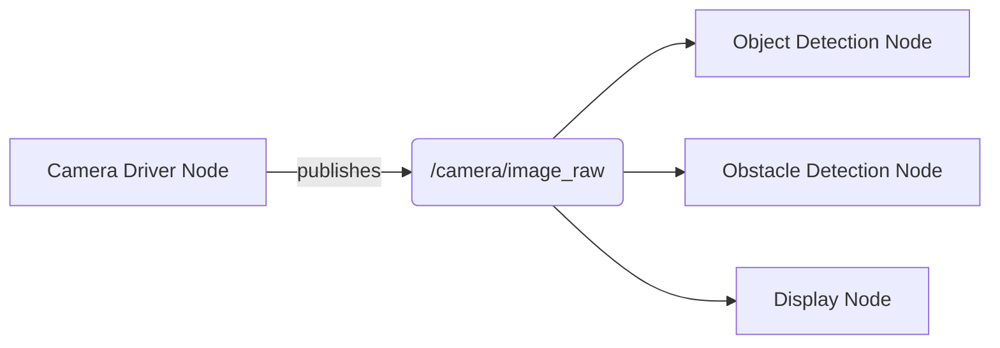

# Chapter 2: The Nervous System of Robots - ROS 2 as the Middleware of Physical AI

## Opening Narrative: The Symphony of Distributed Intelligence

Imagine a humanoid robot performing a complex task: preparing coffee in a busy kitchen. Its camera eyes identify the coffee maker, its tactile sensors feel the weight of the water reservoir, its IMU maintains balance as it reaches across the counter, and its force sensors ensure the perfect grip on the coffee mug. Each of these components operates independently, yet they must coordinate seamlessly to achieve the goal. The camera doesn't need to know about the tactile sensors, nor do the balance controllers need to understand the vision system. Yet somehow, they work together in perfect harmony.

This coordination is made possible by the Robot Operating System 2 (ROS 2)—the nervous system of modern robotics. Just as your brain coordinates billions of neurons through complex signaling pathways, ROS 2 orchestrates hundreds of software components, each specialized for specific tasks, into a unified intelligent system. But unlike the human nervous system, ROS 2 is designed for the digital age, with security, real-time performance, and distributed computing at its core.

This chapter reveals the architecture of distributed intelligence in Physical AI systems. We'll explore how ROS 2 enables the seamless integration of perception, action, and cognition across multiple software components, creating the foundation for truly embodied artificial intelligence.

## The Evolution of Robotic Middleware: From Monolithic to Distributed

### The Monolithic Approach: A Historical Perspective

Early robotic systems were built like castles—monolithic structures where every component was tightly coupled to every other component. A navigation system might have direct dependencies on the sensor processing code, which in turn was intertwined with the motor control algorithms. This approach had certain advantages: everything was in one place, debugging was straightforward, and performance was predictable.

But like castles, monolithic systems were inflexible and difficult to extend. Adding a new sensor required modifying multiple parts of the system. Changing the motor controller could break the navigation system. Most critically, monolithic systems were brittle—when one component failed, the entire robot often became inoperable.

### The Distributed Revolution: Decoupling Intelligence

The breakthrough came with the realization that robotic intelligence, like biological intelligence, is inherently distributed. Your visual cortex doesn't need to know about your motor cortex to process visual information, yet the two systems coordinate seamlessly when you reach for an object. Similarly, a robot's vision system should be able to operate independently while still communicating with planning and control systems.

This insight led to the development of middleware systems—software layers that enable communication between different components without requiring direct dependencies. ROS 2 represents the mature evolution of this approach, designed from the ground up for the distributed nature of modern robotics.

### Why ROS 2 Specifically: The Physical AI Requirements

Physical AI systems have unique requirements that shaped ROS 2's design:

**Real-time Performance**: When a humanoid robot is walking, balance corrections must happen within milliseconds. ROS 2's Quality of Service (QoS) policies ensure that critical messages are delivered with appropriate timing guarantees.

**Security**: As robots move into human environments, security becomes paramount. ROS 2 includes built-in authentication, authorization, and encryption to protect against unauthorized access.

**Distributed Operation**: Modern robots often involve multiple computers, edge devices, and cloud services. ROS 2's DDS-based architecture handles distributed communication seamlessly.

**Professional Deployment**: Moving from research labs to commercial applications requires production-ready features. ROS 2 includes tools for monitoring, logging, and system management that are essential for deployed systems.

## The Architecture of Distributed Intelligence

### Nodes: The Processing Units of Physical AI

In ROS 2, computation is organized into **nodes**—independent processes that perform specific functions. Think of nodes as specialized organs in a robotic body:

- A **vision node** processes camera data to identify objects and navigate
- A **control node** manages motor commands and maintains balance
- A **planning node** determines optimal paths and action sequences
- A **sensor fusion node** combines information from multiple sensors

Each node operates independently, with its own memory space and processing thread. This isolation provides robustness—if one node crashes, others continue operating. It also enables specialization—vision algorithms can be optimized for GPUs while control algorithms run on real-time processors.

```
mermaid
graph LR
    A[Vision Node] --> D[(ROS 2 Network)]
    B[Control Node] --> D
    C[Planning Node] --> D
    D --> E[Sensor Fusion Node]
    D --> F[Navigation Node]
    D --> G[Human Interface Node]
```

### Communication Patterns: The Neural Pathways of Robotics

ROS 2 provides three primary communication patterns, each suited to different types of interaction:

#### Topics: The Sensory Pathways

**Topics** implement the publish-subscribe pattern, analogous to sensory pathways in biological systems. A sensor node publishes data to a topic (like `/camera/image_raw`), and any number of other nodes can subscribe to receive that data. This is perfect for sensor streams where multiple components need the same information:

- The vision system processes camera images for object recognition
- The navigation system uses the same images for obstacle detection
- The human interface system displays the images for monitoring



The beauty of topics is their decoupling: the camera driver doesn't know or care how many nodes are listening, and the subscribers don't need to know where the data comes from. This enables flexible system composition.

#### Services: The Command and Control Pathways

**Services** provide synchronous request-response communication, similar to command pathways in biological systems. A navigation node might request a path from a path-planning service, wait for the response, then execute the path. Services are ideal for discrete, well-defined operations:

- Requesting a path between two points
- Querying the robot's current state
- Triggering a calibration procedure
- Requesting object identification

The synchronous nature means the requesting node waits for completion, ensuring proper sequencing of operations.

#### Actions: The Goal-Oriented Pathways

**Actions** represent the most sophisticated communication pattern, designed for long-running, goal-oriented tasks with feedback. Like biological goal-oriented behaviors (walking to a destination, grasping an object), actions have:

- **Goals**: What the action should accomplish
- **Feedback**: Progress updates during execution
- **Results**: Final outcome when complete
- **Preemption**: Ability to cancel ongoing actions

This is perfect for complex behaviors like navigation ("go to this location"), manipulation ("pick up that object"), or exploration ("map this area").

## Quality of Service: Tuning the Neural Network

One of ROS 2's most powerful features is its Quality of Service (QoS) system, which allows fine-tuning of communication characteristics. Just as biological neural pathways have different properties—some prioritize speed, others reliability, others precision—ROS 2 allows nodes to specify their communication requirements:

**Reliability Policy**: Should messages be guaranteed delivery (like critical safety data) or is best-effort sufficient (like high-frequency sensor data where occasional loss is acceptable)?

**Durability Policy**: Should late-joining subscribers receive recent messages (like system status) or only future messages (like real-time sensor data)?

**History Policy**: How many messages should be kept for late subscribers?

**Deadline**: How old can a message be before it becomes useless?

These policies ensure that different types of data receive appropriate handling, optimizing system performance while maintaining reliability where needed.

## The Code Behind the Coordination: Practical Implementation

### Building a Physical AI Node

Let's examine how these concepts translate into practice with a ROS 2 node that embodies the distributed intelligence principles of Physical AI:

```python
#!/usr/bin/env python3
"""
Physical AI Coordination Node
This node demonstrates distributed intelligence by coordinating
multiple sensor and action components in a unified behavior.
"""

import rclpy
from rclpy.node import Node
from rclpy.qos import QoSProfile, ReliabilityPolicy, DurabilityPolicy
from sensor_msgs.msg import Image, LaserScan, Imu
from geometry_msgs.msg import Twist, PoseStamped
from std_msgs.msg import String
from action_msgs.msg import GoalStatus
from rclpy.action import ActionClient
from rclpy.callback_groups import ReentrantCallbackGroup
from rclpy.executors import MultiThreadedExecutor
import threading
import time
import numpy as np
from dataclasses import dataclass
from typing import Dict, Optional, Callable
import json

@dataclass
class RobotState:
    """Comprehensive robot state for Physical AI coordination"""
    position: np.ndarray = None
    orientation: np.ndarray = None  # quaternion
    velocity: np.ndarray = None
    angular_velocity: np.ndarray = None
    sensors_active: Dict[str, bool] = None
    battery_level: float = 100.0
    last_update: float = 0.0

    def __post_init__(self):
        if self.position is None:
            self.position = np.zeros(3)
        if self.orientation is None:
            self.orientation = np.array([0.0, 0.0, 0.0, 1.0])  # w, x, y, z
        if self.velocity is None:
            self.velocity = np.zeros(3)
        if self.angular_velocity is None:
            self.angular_velocity = np.zeros(3)
        if self.sensors_active is None:
            self.sensors_active = {}

class PhysicalAICoordinator(Node):
    """
    The nervous system of a Physical AI system - coordinating distributed intelligence
    across multiple nodes and sensors to achieve coherent behavior.

    This node embodies the principles of distributed intelligence by:
    1. Aggregating information from multiple sensor nodes
    2. Coordinating action execution across multiple systems
    3. Maintaining coherent state across distributed components
    4. Managing Quality of Service for different communication patterns
    """

    def __init__(self):
        super().__init__('physical_ai_coordinator')

        # Initialize comprehensive robot state
        self.robot_state = RobotState()
        self.state_lock = threading.RLock()  # Thread-safe state management

        # Create QoS profiles for different communication needs
        self.high_reliability_qos = QoSProfile(
            depth=10,
            reliability=ReliabilityPolicy.RELIABLE,
            durability=DurabilityPolicy.VOLATILE
        )

        self.best_effort_qos = QoSProfile(
            depth=5,
            reliability=ReliabilityPolicy.BEST_EFFORT,
            durability=DurabilityPolicy.VOLATILE
        )

        # Sensor data subscribers with appropriate QoS
        self.image_subscription = self.create_subscription(
            Image,
            '/camera/image_raw',
            self.image_callback,
            self.best_effort_qos,  # Vision data - best effort is often sufficient
            callback_group=ReentrantCallbackGroup()  # Enable concurrent callbacks
        )

        self.laser_subscription = self.create_subscription(
            LaserScan,
            '/scan',
            self.laser_callback,
            self.high_reliability_qos,  # Navigation data - needs reliability
            callback_group=ReentrantCallbackGroup()
        )

        self.imu_subscription = self.create_subscription(
            Imu,
            '/imu/data',
            self.imu_callback,
            self.high_reliability_qos,  # Balance data - needs reliability
            callback_group=ReentrantCallbackGroup()
        )

        # Publishers for coordinated actions
        self.cmd_vel_publisher = self.create_publisher(
            Twist,
            '/cmd_vel',
            self.high_reliability_qos
        )

        self.status_publisher = self.create_publisher(
            String,
            '/ai_status',
            self.best_effort_qos
        )

        # Action clients for goal-oriented behaviors
        self.navigation_client = ActionClient(
            self,
            NavigateToPose,  # Assuming this action type exists
            'navigate_to_pose'
        )

        # Service clients for synchronous operations
        self.perception_client = self.create_client(
            DetectObjects,  # Assuming this service type exists
            'detect_objects'
        )

        # Timer for coordination loop
        self.coordination_timer = self.create_timer(
            0.1,  # 10 Hz coordination
            self.coordination_loop,
            callback_group=ReentrantCallbackGroup()
        )

        # Emergency stop timer for safety
        self.emergency_timer = self.create_timer(
            0.05,  # 20 Hz safety checks
            self.emergency_procedures,
            callback_group=ReentrantCallbackGroup()
        )

        # Task queue for coordinated behaviors
        self.task_queue = []
        self.current_task = None

        # Behavior state machine
        self.behavior_state = 'IDLE'  # IDLE, NAVIGATING, MANIPULATING, etc.

        self.get_logger().info('Physical AI Coordinator initialized')
        self.get_logger().info('Distributed intelligence system online')

    def image_callback(self, msg):
        """Process visual information from the robot's "eyes" """
        with self.state_lock:
            # Extract visual features and update state
            # In practice, this might trigger object detection services
            # or update visual SLAM maps
            self.robot_state.last_update = time.time()
            self.robot_state.sensors_active['camera'] = True

            # Log visual events for higher-level reasoning
            status_msg = String()
            status_msg.data = json.dumps({
                'timestamp': time.time(),
                'event': 'visual_input',
                'data': {
                    'encoding': msg.encoding,
                    'height': msg.height,
                    'width': msg.width
                }
            })
            self.status_publisher.publish(status_msg)

    def laser_callback(self, msg):
        """Process LIDAR data for navigation and obstacle detection"""
        with self.state_lock:
            # Analyze laser scan for obstacles and free space
            ranges = np.array(msg.ranges)
            valid_ranges = ranges[np.isfinite(ranges) & (ranges > msg.range_min) & (ranges < msg.range_max)]

            if len(valid_ranges) > 0:
                min_distance = np.min(valid_ranges)
                avg_distance = np.mean(valid_ranges)

                # Update robot state with navigation-relevant information
                self.robot_state.sensors_active['laser'] = True

                # Check for immediate obstacles
                if min_distance < 0.5:  # 50 cm threshold
                    self.get_logger().warn(f'Obstacle detected at {min_distance:.2f}m')

    def imu_callback(self, msg):
        """Process IMU data for balance and orientation"""
        with self.state_lock:
            # Update orientation and acceleration data
            self.robot_state.orientation = np.array([
                msg.orientation.w, msg.orientation.x,
                msg.orientation.y, msg.orientation.z
            ])

            self.robot_state.angular_velocity = np.array([
                msg.angular_velocity.x, msg.angular_velocity.y, msg.angular_velocity.z
            ])

            self.robot_state.sensors_active['imu'] = True

    def coordination_loop(self):
        """Main coordination loop - the "thought process" of the robot"""
        with self.state_lock:
            # Update robot state timestamp
            self.robot_state.last_update = time.time()

            # Check if we have sufficient sensor data for intelligent action
            if not self.sensors_operational():
                self.get_logger().warn('Insufficient sensor data for intelligent operation')
                self.stop_robot()
                return

            # Process task queue and execute coordinated behaviors
            self.execute_task_queue()

            # Update behavior state based on current situation
            self.update_behavior_state()

            # Publish status for monitoring and debugging
            self.publish_coordinated_status()

    def sensors_operational(self) -> bool:
        """Check if critical sensors are functioning"""
        required_sensors = ['laser', 'imu']  # Minimum for safe operation
        return all(self.robot_state.sensors_active.get(s, False) for s in required_sensors)

    def execute_task_queue(self):
        """Execute coordinated tasks from the queue"""
        if not self.task_queue and not self.current_task:
            # If no tasks, perform environmental monitoring
            self.perform_monitoring_behavior()
            return

        if not self.current_task and self.task_queue:
            # Start next task from queue
            self.current_task = self.task_queue.pop(0)

        if self.current_task:
            # Execute current task based on type
            task_type = self.current_task.get('type', 'unknown')

            if task_type == 'navigate':
                self.execute_navigation_task(self.current_task)
            elif task_type == 'explore':
                self.execute_exploration_task(self.current_task)
            elif task_type == 'monitor':
                self.execute_monitoring_task(self.current_task)
            else:
                self.get_logger().warn(f'Unknown task type: {task_type}')
                self.current_task = None

    def perform_monitoring_behavior(self):
        """Default behavior when no specific tasks are queued"""
        # Continue current motion or stop if no motion is ongoing
        # Monitor sensors for interesting events
        pass

    def execute_navigation_task(self, task):
        """Execute a navigation task with coordinated sensing"""
        target = task.get('target')
        if not target:
            self.get_logger().error('Navigation task missing target')
            self.current_task = None
            return

        # Check if path is clear using LIDAR data
        if self.is_path_clear_to(target):
            # Send navigation goal
            goal_msg = NavigateToPose.Goal()
            goal_msg.pose = target  # Assuming PoseStamped format
            self.navigation_client.send_goal_async(goal_msg)
        else:
            self.get_logger().warn('Path to target is not clear')
            self.current_task = None

    def is_path_clear_to(self, target) -> bool:
        """Check if path to target is clear using current sensor data"""
        # In practice, this would use a more sophisticated path planner
        # For now, we'll check if there are no immediate obstacles
        with self.state_lock:
            # Simple check: if minimum distance is large enough
            # A real implementation would project the path to the target
            # and check for obstacles along that path
            return True  # Placeholder - implement proper path checking

    def execute_exploration_task(self, task):
        """Execute exploration behavior with coordinated sensing"""
        # Move to explore new areas while maintaining safety
        # Use vision to identify interesting features
        # Use LIDAR to avoid obstacles
        # Use IMU to maintain balance
        pass

    def execute_monitoring_task(self, task):
        """Execute monitoring behavior for surveillance or observation"""
        # Track specific objects or areas
        # Maintain vigilance for changes in environment
        pass

    def update_behavior_state(self):
        """Update the high-level behavior state"""
        with self.state_lock:
            # Determine behavior state based on current situation
            if self.current_task:
                task_type = self.current_task.get('type', 'unknown')
                if task_type == 'navigate':
                    self.behavior_state = 'NAVIGATING'
                elif task_type == 'explore':
                    self.behavior_state = 'EXPLORING'
                else:
                    self.behavior_state = 'ACTIVE'
            else:
                self.behavior_state = 'IDLE'

    def publish_coordinated_status(self):
        """Publish comprehensive status for monitoring"""
        status_msg = String()
        status_msg.data = json.dumps({
            'timestamp': time.time(),
            'behavior_state': self.behavior_state,
            'sensors_active': self.robot_state.sensors_active,
            'position': self.robot_state.position.tolist(),
            'battery': self.robot_state.battery_level,
            'task_queue_length': len(self.task_queue),
            'current_task': self.current_task
        })
        self.status_publisher.publish(status_msg)

    def emergency_procedures(self):
        """Critical safety checks that run at high frequency"""
        with self.state_lock:
            # Check for critical sensor failures
            if not self.sensors_operational():
                self.emergency_stop()
                return

            # Check for dangerous situations
            # (This would include more sophisticated checks in practice)
            if self.robot_state.battery_level < 5.0:
                self.return_to_base()

    def emergency_stop(self):
        """Immediate stop for safety"""
        self.get_logger().fatal('EMERGENCY STOP ACTIVATED')
        self.stop_robot()

    def stop_robot(self):
        """Send stop command to robot"""
        stop_msg = Twist()
        stop_msg.linear.x = 0.0
        stop_msg.linear.y = 0.0
        stop_msg.linear.z = 0.0
        stop_msg.angular.x = 0.0
        stop_msg.angular.y = 0.0
        stop_msg.angular.z = 0.0
        self.cmd_vel_publisher.publish(stop_msg)

    def return_to_base(self):
        """Initiate return-to-base behavior"""
        self.get_logger().info('Returning to base due to low battery')
        # Add return-to-base task to queue
        return_task = {
            'type': 'navigate',
            'target': self.get_parameter_or('base_pose', default_value=None)
        }
        self.task_queue.insert(0, return_task)

    def add_task(self, task: Dict):
        """Add a task to the coordination queue"""
        with self.state_lock:
            self.task_queue.append(task)
            self.get_logger().info(f'Added task to queue: {task.get("type", "unknown")}')

    def queue_navigation_task(self, target_pose):
        """Convenience method to queue a navigation task"""
        nav_task = {
            'type': 'navigate',
            'target': target_pose
        }
        self.add_task(nav_task)

    def queue_exploration_task(self):
        """Convenience method to queue an exploration task"""
        explore_task = {
            'type': 'explore',
            'parameters': {}
        }
        self.add_task(explore_task)

def main(args=None):
    """Main function to run the Physical AI Coordinator"""
    rclpy.init(args=args)

    # Use multi-threaded executor to handle concurrent callbacks
    executor = MultiThreadedExecutor(num_threads=4)

    coordinator = PhysicalAICoordinator()
    executor.add_node(coordinator)

    try:
        coordinator.get_logger().info('Starting Physical AI Coordinator')
        executor.spin()
    except KeyboardInterrupt:
        coordinator.get_logger().info('Shutting down Physical AI Coordinator')
    finally:
        coordinator.destroy_node()
        rclpy.shutdown()

if __name__ == '__main__':
    main()
```

This implementation demonstrates several key principles of distributed intelligence in Physical AI:

1. **Modular Design**: Each component (sensors, actuators, planners) operates independently but coordinates through ROS 2.

2. **Quality of Service**: Different types of data receive appropriate communication guarantees.

3. **Thread Safety**: Proper locking mechanisms ensure state consistency across concurrent operations.

4. **Safety First**: Continuous monitoring and emergency procedures ensure safe operation.

5. **Behavior Coordination**: Higher-level behaviors coordinate multiple lower-level components.

## Systems Thinking: The Architecture of Intelligence

### The Trade-offs of Distributed Design

Distributed systems like ROS 2 offer powerful advantages but also introduce complexity. The key trade-offs include:

**Flexibility vs. Complexity**: Distributed systems can be reconfigured and extended easily, but they require more sophisticated design and debugging tools.

**Robustness vs. Performance**: Isolated components provide robustness (failure isolation), but communication overhead can impact performance.

**Scalability vs. Coordination**: Adding new components is straightforward, but coordinating their interactions becomes more complex.

ROS 2 addresses these trade-offs through its QoS system, tooling, and architectural patterns that make distributed design manageable.

### Failure Modes and Resilience

Physical AI systems must be designed with failure in mind. In a distributed architecture, failures can occur at multiple levels:

**Node Failures**: Individual components may crash or become unresponsive. ROS 2's node discovery and monitoring tools help detect and handle these failures.

**Communication Failures**: Network issues can disrupt message delivery. QoS policies and redundant communication paths provide resilience.

**Data Inconsistency**: Distributed state can become inconsistent. Proper synchronization and state management protocols maintain coherence.

**Resource Exhaustion**: Components may consume excessive resources. Monitoring and resource management tools help maintain system stability.

## Reflection and Discussion Questions

1. **Distributed vs. Centralized Intelligence**: What are the advantages and disadvantages of distributed intelligence architectures like ROS 2 compared to centralized approaches? When would you choose one over the other?

2. **Quality of Service Trade-offs**: How do different QoS policies affect system behavior? Design a QoS strategy for a robot operating in a hospital environment where some data is safety-critical while other data is for monitoring.

3. **Scalability Considerations**: As robot systems grow more complex with dozens or hundreds of nodes, what challenges arise in coordination and communication? How might ROS 2's architecture need to evolve?

4. **Biological Analogies**: How does the ROS 2 architecture compare to biological nervous systems? What can we learn from biology about designing more effective robotic communication systems?

5. **Security and Trust**: How should distributed robotic systems handle security, especially when components may be developed by different organizations? What trust models are appropriate?

## Looking Forward: From Coordination to Simulation

This chapter has explored the nervous system of Physical AI—the middleware that enables distributed intelligence to function as a unified whole. We've seen how ROS 2's architecture supports the complex coordination required for embodied intelligence, with appropriate handling of different types of data and communication patterns.

But intelligence must be tested and validated before deployment in the physical world. The next chapter explores simulation environments—virtual worlds where Physical AI systems can learn, adapt, and prove their capabilities before engaging with the unpredictable reality of the physical world. In simulation, we can accelerate learning, test dangerous scenarios safely, and iterate on designs rapidly—a crucial capability for the development of truly intelligent physical systems.

The journey from sensing to coordination to simulation represents the essential pipeline of Physical AI development, where abstract algorithms become embodied intelligence capable of navigating and interacting with the physical world.